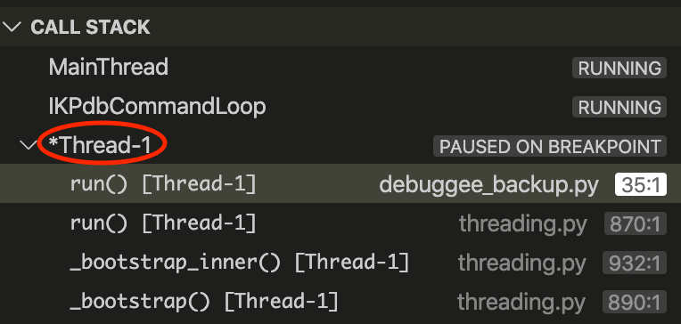
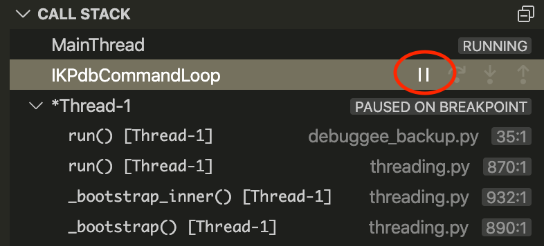

# Debugging of Multithreaded Programs

Multithreaded debugging is supported.

## Currently Debugged Thread

IKp3db permanently identifies the 'currently debugged thread'.
In VS Code GUI, the 'currently debugged thread' is identified by his name which starts 
with a star in the 'CALL STACK' pane.

When debugger starts there is no 'currently debugged thread'.

The first thread that triggers a Breakpoint becomes the 'currently debugged thread' and 
remains it until it is reset. 

This brings 2 advantages:

* You can step through the 'currently debugged thread' without being polluted by other threads that would reach the same breakpoint.
* Other threads can run normally.

But there is a drawback. If your program creates ephemeral threads (eg. one per http request) and the currently debugged thread terminates. IKP3db won't stop anymore. 
The reason is IKp3db does not overload threads management code to be notified of threads being created or terminated.

Thus, to allow breakpoints to be triggered again, you must reset the 'currently debugged thread manually' by clicking on the stop button of the IKPdbCommandLoop thread in the CALL STACK as show on the next picture.

